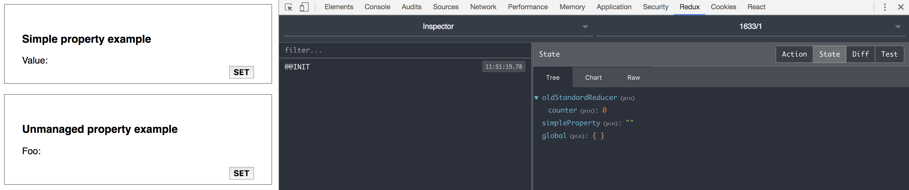
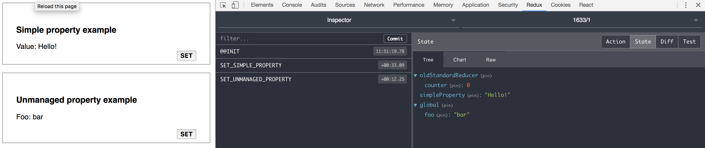

# Redux Reduced
Makes it easier to modify redux state. No reducers, unless you really need them.

[](https://npmjs.org/package/redux-reduced)

[](https://travis-ci.org/emanuelelongo/redux-reduced)
[](https://codecov.io/gh/emanuelelongo/redux-reduced)
[](https://codeclimate.com/github/emanuelelongo/redux-reduced/maintainability)

## Motivation
You know, React/Redux with its actions and reducers is full of boilerplate and sometimes you just want to set one property in the state!

Perhaps your app is still simple and you totally don't need that complexity or maybe, even in a complex scenario, there are aspects that could be managed easily.

**With redux-reduced you can change the state directly inside an action** without writing a single reducer. Unlike other libraries like [redux-zero](https://github.com/concretesolutions/redux-zero), here we are not dealing with an alternative state container: redux-reduced _cooperate_ with redux exposing only an additional feature to your actions. This means that you can:
-  introduce it into your existing React/Redux project
- continue to use fantastic tools like [Redux-DevTools](https://chrome.google.com/webstore/detail/redux-devtools/lmhkpmbekcpmknklioeibfkpmmfibljd)
- use reducers if/when you prefer


## Install and use
``` sh
npm install --save redux-reduced
```

**redux-reduced** consists of a two things, and you need to activate both:
 - a middleware
 - a wrapper function to apply before  the _reducers combining phase_


First, let's apply the middleware, for example:

``` javascript
import { createStore, applyMiddleware } from 'redux'
import { middleware } from 'redux-reduced'
import reducers from './reducers'

const initialState = {}
const store = createStore(
    reducers, 
    initialState, 
    applyMiddleware(middleware)
)
```

Step two, where you usually would combine all the reducers, you can simply use the wrapper:

``` javascript
import { combineReducers } from 'redux'
import { wrapReducers } from 'redux-reduced'

const reducers = combineReducers(wrapReducers({
    exampleCounter: 0
}))

export default reducers
```

As you can see we are not using any reducer here but we are defining <code>exampleCounter</code> as a top-level state property with <code>0</code> as it initial value. It is exactly the same as we had created a reducer like this:

``` javascript
// you don't need to write this

const INITIAL_STATE = 0
export default function exampleCounter(state = INITIAL_STATE, action) {
    switch(action) {
        default: return state
    }
}
```

Now suppose we want create an action that increment the above counter:

``` javascript
export default function increment() {
    return (dispatch, getState, setState) => {
        setState({
            counter: getState().counter + 1
        })
    }
}
```
Done.

If you ever used [Redux-Thunk](https://github.com/gaearon/redux-thunk) you'd be familiar with this form of action and maybe you are wondering if the two library are compatible with each other. Well, I have to say no, you can't use both in the same project. The good news is that you don't need to use both: you can simply replace the <code>thunk</code> middleware with the redux-reduced middleware and your old good code will work. This is because redux-reduced pass a super-set of the parameters actually passed by thunk to your action creators.
Precisely the only additional parameter is <code>setState</code>, the one that allow you to alter the state without dispatching actions: <code>setState({counter: getState().counter + 1 })</code>.

## A closer look
Although the basic idea behind redux-reduced is very simple, there are some relevant use-case to underline. Under the <code>example</code> folder of this repository you'll find a simple app made with [next.js](https://github.com/zeit/next.js/).

You can run the example with:

``` sh
git clone https://github.com/emanuelelongo/redux-reduced.git
cd redux-reduced
npm install
npm link
cd example
npm link redux-reduced
npm install
npm start
open http://localhost:3001
```

If not yet installed, install [Redux-DevTools](https://chrome.google.com/webstore/detail/redux-devtools/lmhkpmbekcpmknklioeibfkpmmfibljd), it is awesome!



As you can see inside the inspector the initial state is composed by few top-level object according to the initialization of the reducers:

``` javascript
// file: example/reducers/index.js

const reducers = combineReducers(wrapReducers({
    oldStandardReducer,
    simpleProperty: ""
}))
```
_Note: There is also an additional property called <code>global</code> that we are going to talk about in the Unmanaged property example._


#### Simple property example
The first example shows a simple action, the thing you should notice here is the last parameter passed to the <code>setState()</code> function: <code>SET_SIMPLE_PROPERTY</code>

``` javascript
export default function setSimpleProperty(value) {
    return (dispatch, getState, setState) => {
        setState({
            simpleProperty: value
        }, 'SET_SIMPLE_PROPERTY')
    }
}
```

This parameter is the _name of the action_. It is optional but by mentioning it you have the following benefits:

- existing reducers will be able to intercept this action
- the redux dev-tool inspector will show a clearer log


#### Unmanaged property example
The second example shows what happen if you try to set a property that wasn't ever initialized into the state.

``` javascript
export default function setUnmanagedProperty(value) {
    return (dispatch, getState, setState) => {
        setState({
            foo: value,
        }, "SET_UNMANAGED_PROPERTY")
    }
}
```



Since <code>foo</code> wasn't in the state, once assigned a value it is positioned under the special root <code>global</code>.
I do not want to say whether it's right or wrong to do such a thing, of course you can use the global space as well you remember to properly map those property when required:

``` javascript 
function mapStateToProps(state) {
    return {
        simple: state.simpleProperty,
        foo: state.global.foo, // <- notice the "global"
        counter: state.oldStandardReducer.counter
    }
}
```
But it's probably worth spending the time to initilize all root properties and let the <code>global</code> the last chance for very exceptional cases.

#### Multiple property example
Within a single action you can se multiple state property, also a mix of managed and unmanaged property are allowed.

``` javascript
export default function setMultipleProperties() {
    return (dispatch, getState, setState) => {
        setState({
            simpleProperty: "-",
            foo: '-',
        }, "SET_MULTIPLE_PROPERTIES")
    }
}
```

#### Old standard reducer example
And as last example: 
``` javascript
export default function(value) {
    return {
        type: 'INCREMENT',
        payload: value
    }
}
```
``` javascript
export default function(value) {
    return (dispatch) => {
        dispatch({
            type: 'DECREMENT',
            payload: value
        })
    }
}
```

Of course you can still use standard actions or thunk-like action with related reducers:

``` javascript
const INITIAL_STATE = { counter: 0 }

export default function (state = INITIAL_STATE, action) {
    switch(action.type) {
        case "INCREMENT": 
            return {
                counter: state.counter + action.payload
            }
        case "DECREMENT": 
            return {
                counter: state.counter - action.payload
            } 
        default: 
            return state
    }
}
```
